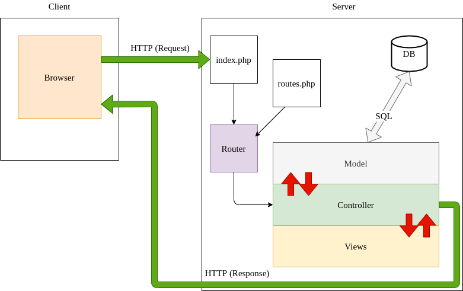

# Simple MVC

## Description

This repository is a simple PHP MVC structure from scratch.

It uses some cool vendors/libraries such as Twig and Grumphp.
For this one, just a simple example where users can choose one of their databases and see tables in it.

## Steps

1. Clone the repo from Github.
2. Run `composer install`.
3. Create *config/db.php* from *config/db.php.dist* file and add your DB parameters. Don't delete the *.dist* file, it must be kept.
```php
define('APP_DB_HOST', 'your_db_host');
define('APP_DB_NAME', 'your_db_name');
define('APP_DB_USER', 'your_db_user_wich_is_not_root');
define('APP_DB_PASSWORD', 'your_db_password');
```
4. Import *database.sql* in your SQL server, you can do it manually or use the *migration.php* script which will import a *database.sql* file.
5. Run the internal PHP webserver with `php -S localhost:8000 -t public/`. The option `-t` with `public` as parameter means your localhost will target the `/public` folder.
6. Go to `localhost:8000` with your favorite browser.
7. From this starter kit, create your own web application.

### Windows Users

If you develop on Windows, you should edit you git configuration to change your end of line rules with this command :

`git config --global core.autocrlf true`

## Example 

An example (a basic list of items) is provided (you can load the *simple-mvc.sql* file in a test database). The accessible URLs are :

* Home page at [localhost:8000/](localhost:8000/)
* Items list at [localhost:8000/items](localhost:8000/items)
* Item details [localhost:8000/items/show?id=:id](localhost:8000/item/show?id=2)
* Item edit [localhost:8000/items/edit?id=:id](localhost:8000/items/edit?id=2)
* Item add [localhost:8000/items/add](localhost:8000/items/add)
* Item deletion [localhost:8000/items/delete?id=:id](localhost:8000/items/delete?id=2)

You can find all these routes declared in the file `src/routes.php`. This is the very same file where you'll add your own new routes to the application.

## How does URL routing work ?




## Ask for a tour !


We prepare a little guided tour to start with the simple-MVC.

To take it, you need to install the `Code Tour` extension for Visual Studio Code : [Code Tour](https://marketplace.visualstudio.com/items?itemName=vsls-contrib.codetour)

It will give access to a new menu on your IDE where you'll find the different tours about the simple-MVC. Click on play to start one : 


## Debug Objectif: afficher la page listant les items actuellement en base
```
composer.json : scr au lieu de src dans l'autoload
Dossier Controller renommé en Controler
AbstractController : abstract class > class abstract
index.php : exit en haut du fichier;
ItemController, méthode index() :
    retour de la méthode typé en array
    return retiré
    namespace App\\Controller au lieu de App\Controller
    $itemManager->selectAll() modif en $this->selectA11() (2 "un" au lieu des 2 "L")
    appel de index.twig au lieu de index.html.twig
    dans le passage de param à la vue, 'items'=>$items modif en '$items'=>$items
ItemManager :
    extend au lieu d'extends
    point virgule manquant au bout de la constante TABLE
AbstractManager:
    ajout d'un 3eme antislash au __construct > ___construct
Item/index.html.twig :
    inversion items et item dans le for
    item.title > item.tilte
    h1 en dehors du bloc content
    {{extends ... }} au lieu de 
    inversion des balises fermantes </a> et </li>
style.css :
    color:white sur le body
    display:none sur le ul
    opacity:0 sur le li
```